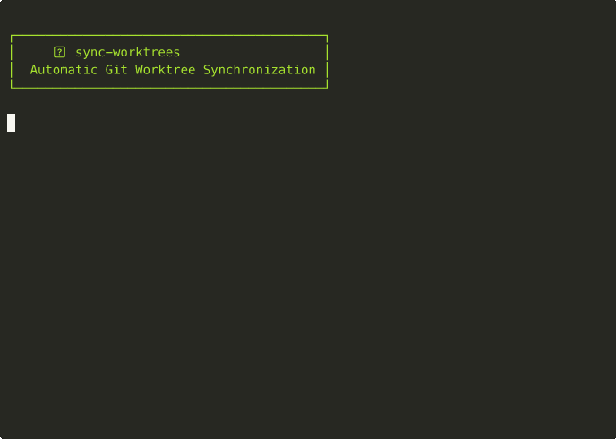

# sync-worktrees

Automatically synchronize Git worktrees with remote branches. Keep your local worktrees in sync with remote repositories - perfect for multi-branch development workflows and automated testing setups.



## How it works

sync-worktrees maintains a **separate working directory for each remote branch**, all sharing the same Git repository:

1. **First run**: Clones your repository as a bare repository (no working files, just Git data)
2. **Automatic sync**: 
   - Creates a dedicated worktree for **every remote branch** (`main`, `develop`, `feature/*`, etc.)
   - Each branch gets its own isolated directory with a full working copy
   - Fetches latest changes (doesn't merge - preserves your local work)
   - Removes worktrees when remote branches are deleted (preserves local changes)

**Why this matters**: Switch between branches instantly without stashing, run tests on multiple branches simultaneously, or keep your CI and production branches always ready.

## Features

- 🔄 Automatically creates worktrees for all remote branches
- 🗑️ Removes worktrees for deleted remote branches (preserves local changes)
- ⏰ Run as a scheduled cron job or one-time execution
- 🛡️ Safe operations - won't delete worktrees with uncommitted changes or unpushed commits
- 📝 Clear logging with timestamps and progress indicators
- 📋 Config file support for managing multiple repositories
- 🔁 Automatic retry with exponential backoff for network and filesystem errors
- 🕐 Branch age filtering - only sync branches active within a specified time period

## Installation

```bash
npm install -g sync-worktrees
```

Or with pnpm:

```bash
pnpm add -g sync-worktrees
```

## Usage

### Interactive Mode

When running without all required arguments, sync-worktrees will prompt you interactively:

```bash
# Interactive setup - prompts for missing values
sync-worktrees

# Or provide partial arguments and be prompted for the rest
sync-worktrees --repoUrl https://github.com/user/repo.git
```

### Command Line

```bash
# Single repository (one-time sync)
sync-worktrees --repoUrl https://github.com/user/repo.git --worktreeDir ./worktrees --runOnce

# Single repository (scheduled hourly)
sync-worktrees --repoUrl https://github.com/user/repo.git --worktreeDir ./worktrees

# Multiple repositories (using config file)
sync-worktrees --config ./sync-worktrees.config.js
```

## Options

| Option | Alias | Description | Required | Default |
|--------|-------|-------------|----------|---------|
| `--config` | `-c` | Path to JavaScript config file | No | - |
| `--filter` | `-f` | Filter repositories by name (wildcards supported) | No | - |
| `--list` | `-l` | List configured repositories and exit | No | `false` |
| `--repoUrl` | `-u` | Git repository URL (HTTPS or SSH) | Yes* | - |
| `--bareRepoDir` | `-b` | Directory for bare repository | No | `.bare/<repo-name>` |
| `--worktreeDir` | `-w` | Directory for storing worktrees | Yes* | - |
| `--cronSchedule` | `-s` | Cron pattern for scheduling | No | `0 * * * *` (hourly) |
| `--runOnce` | - | Execute once and exit | No | `false` |
| `--branchMaxAge` | `-a` | Maximum age of branches to sync (e.g., '30d', '6m', '1y') | No | - |
| `--help` | `-h` | Show help | No | - |

\* Required when not using a config file

## Examples

### Single repository
```bash
# One-time sync
sync-worktrees -u https://github.com/user/repo.git -w ./worktrees --runOnce

# Scheduled sync (every 30 minutes)
sync-worktrees -u git@github.com:user/repo.git -w ./worktrees -s "*/30 * * * *"

# Only sync branches active in the last 30 days
sync-worktrees -u https://github.com/user/repo.git -w ./worktrees --branchMaxAge 30d

# Sync branches active in the last 6 months, check every hour
sync-worktrees -u git@github.com:user/repo.git -w ./worktrees --branchMaxAge 6m
```

### Using a config file
```bash
# Sync all repositories
sync-worktrees --config ./sync-worktrees.config.js

# Filter specific repositories
sync-worktrees --config ./sync-worktrees.config.js --filter "frontend-*"

# List configured repositories
sync-worktrees --config ./sync-worktrees.config.js --list
```

## Configuration File

For managing multiple repositories, create a JavaScript config file:

```javascript
module.exports = {
  // Optional defaults for all repositories
  defaults: {
    cronSchedule: "0 * * * *",  // Hourly
    runOnce: false,
    branchMaxAge: "30d"  // Only sync branches active in last 30 days
  },
  
  // Retry configuration (optional - these are the defaults)
  retry: {
    maxAttempts: 'unlimited',  // or a number like 5
    initialDelayMs: 1000,      // Start with 1 second
    maxDelayMs: 600000,        // Max 10 minutes between retries
    backoffMultiplier: 2       // Double the delay each time
  },
  
  repositories: [
    {
      name: "frontend",  // Unique identifier
      repoUrl: "https://github.com/company/frontend.git",
      worktreeDir: "./worktrees/frontend",  // Relative paths supported
      cronSchedule: "*/30 * * * *"  // Override default
    },
    {
      name: "backend",
      repoUrl: process.env.BACKEND_REPO_URL,  // Environment variables supported
      worktreeDir: "/absolute/path/backend-worktrees",
      branchMaxAge: "6m",  // Override: only sync branches active in last 6 months
      // Uses default schedule
      retry: { maxAttempts: 10 }  // Override retry for this repo
    }
  ]
};
```

**Notes:**
- Relative paths are resolved from the config file location
- `bareRepoDir` defaults to `.bare/<repo-name>` if not specified
- Repository-specific settings override defaults

### Retry Configuration

The tool automatically retries on network errors and filesystem race conditions:

- **Default behavior**: Unlimited retries with exponential backoff (1s, 2s, 4s... up to 10 minutes)
- **Network errors**: Connection timeouts, DNS failures, repository access issues
- **Filesystem errors**: Busy files, permission issues, race conditions

Simple retry examples:
```javascript
// Global retry configuration
retry: { maxAttempts: 5 }                    // Try 5 times then stop
retry: { maxAttempts: 'unlimited' }          // Keep trying forever (default)
retry: { maxDelayMs: 60000 }                 // Cap retry delay at 1 minute
retry: { initialDelayMs: 5000 }              // Start with 5 second delay

// Per-repository override
repositories: [{
  name: "critical-repo",
  // ... other config ...
  retry: { maxAttempts: 'unlimited', initialDelayMs: 10000 }
}]
```

### Git LFS Support

For repositories with Git LFS issues or when large files aren't needed:

```bash
# Skip LFS downloads
sync-worktrees -u https://github.com/user/repo.git -w ./worktrees --skip-lfs

# Or in config file
defaults: {
  skipLfs: true
}
```

The tool automatically handles LFS errors by retrying with LFS disabled (max 2 retries by default, configurable via `retry.maxLfsRetries`).

### Branch Age Filtering

To reduce clutter and save disk space, you can configure sync-worktrees to only sync branches that have been active within a specified time period. This is particularly useful for repositories with many stale or abandoned branches.

**Duration format**: `<number><unit>`
- `h` - hours (e.g., `24h`)
- `d` - days (e.g., `30d`)
- `w` - weeks (e.g., `4w`)
- `m` - months (e.g., `6m`)
- `y` - years (e.g., `1y`)

**Examples**:
```bash
# Command line
sync-worktrees -u https://github.com/user/repo.git -w ./worktrees --branchMaxAge 30d

# Config file - global default
defaults: {
  branchMaxAge: "90d"  // Only sync branches active in last 90 days
}

# Config file - per repository
repositories: [{
  name: "active-project",
  branchMaxAge: "14d",  // Very active project - only last 2 weeks
}, {
  name: "legacy-project",
  branchMaxAge: "1y",   // Legacy project - keep branches from last year
}]
```

When branch filtering is active, the tool will:
- Fetch commit timestamps for all remote branches
- Filter out branches older than the specified age
- Log how many branches were excluded
- Only create/maintain worktrees for active branches

## Requirements

- Node.js >= 22.0.0
- Git

## Contributing

Contributions are welcome! Please feel free to submit a Pull Request.

## License

MIT © [Yordan Kanchelov](https://github.com/yordan-kanchelov)
