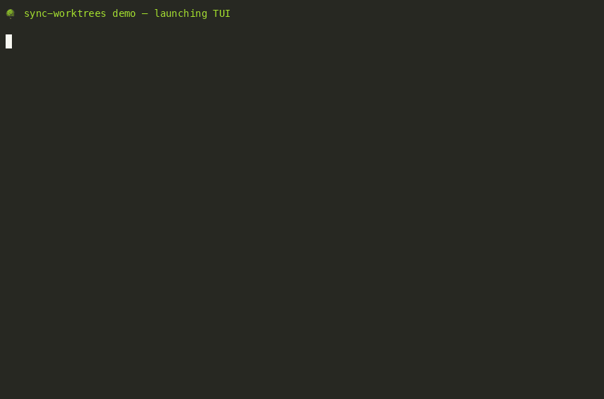

# sync-worktrees

Automatically synchronize Git worktrees with remote branches. Keep your local worktrees in sync with remote repositories - perfect for multi-branch development workflows and automated testing setups.



## How it works

sync-worktrees maintains a **separate working directory for each remote branch**, all sharing the same Git repository:

1. **First run**: Clones your repository as a bare repository (no working files, just Git data)
2. **Automatic sync**: 
   - Creates a dedicated worktree for **every remote branch** (`main`, `develop`, `feature/*`, etc.)
   - Each branch gets its own isolated directory with a full working copy
   - Fetches latest changes (doesn't merge - preserves your local work)
   - Removes worktrees when remote branches are deleted (preserves local changes)

**Why this matters**: Switch between branches instantly without stashing, run tests on multiple branches simultaneously, or keep your CI and production branches always ready.

## Features

- 🔀 **Stop stashing** — every remote branch lives in its own directory. Switch branches with `cd`, not `git checkout`.
- 🤖 **Zero manual upkeep** — new remote branches spawn worktrees automatically; deleted ones get pruned (only when safe).
- 🛡️ **Won't lose your work** — refuses to remove worktrees with uncommitted changes, unpushed commits, stashes, or in-progress merges/rebases.
- 🪂 **Survives force-pushes** — detects diverged branches and quarantines local commits in `.diverged/` before resetting to upstream.
- ⌨️ **Open in one keystroke** — TUI with `o` to launch `tmux` or `$EDITOR` directly in the selected worktree.
- 🧠 **MCP-ready** — bundled `sync-worktrees-mcp` server lets Claude Code, Cursor, Windsurf inspect and manage worktrees.
- ⏰ **Set and forget** — cron or one-shot, auto-retry on network/LFS hiccups, filter branches by age or name pattern to cut noise.

## Installation

```bash
npm install -g sync-worktrees
```

Or with pnpm:

```bash
pnpm add -g sync-worktrees
```

## Usage

Run `sync-worktrees` in any directory:

- **First run** — no config found → interactive wizard asks for repo URL, worktree directory, and schedule, then saves `sync-worktrees.config.js` in the current directory and starts syncing.
- **Subsequent runs** — `sync-worktrees` auto-loads `sync-worktrees.config.js` (or `.mjs` / `.cjs`) from the current directory. No flags needed.

```bash
cd ~/projects/my-sync-dir
sync-worktrees           # wizard → saves config → runs
sync-worktrees           # re-uses the saved config
```

To manage multiple repositories, edit the generated config file and add entries under `repositories`. See [Configuration File](#configuration-file).

### Explicit config path

Useful when the config lives outside the current directory:

```bash
sync-worktrees --config /path/to/sync-worktrees.config.js
sync-worktrees --config ./config.js --filter "frontend-*"
sync-worktrees --config ./config.js --list
```

### Opening a worktree from the TUI

Press `o` in the interactive TUI to open the selected worktree. The wizard supports two modes, toggled with `Tab`:

- **Terminal** (default) — launches a new terminal window with a `tmux` session attached to the worktree directory. Session name is `<repo>-<sanitized-branch>`; re-opening the same worktree attaches to the existing session instead of creating a duplicate.
- **Editor** — launches `$EDITOR` / `$VISUAL` (falls back to `code`) in the worktree.

Terminal mode requires [`tmux`](https://github.com/tmux/tmux) to be installed.

#### Environment variables

| Variable | Purpose | Default behavior |
|----------|---------|------------------|
| `SYNC_WORKTREES_TERMINAL` | Override the terminal launcher on any platform. Value is a command string; the tmux invocation is appended via `sh -c`. Example: `SYNC_WORKTREES_TERMINAL="alacritty -e"`. | See per-platform defaults below. |
| `TERMINAL` | Linux-only fallback when `SYNC_WORKTREES_TERMINAL` is unset. Same format. | Probes `gnome-terminal`, `konsole`, `alacritty`, `kitty`, `xterm` in order. |
| `EDITOR` / `VISUAL` | Editor mode launcher. | Falls back to `code`. |

Per-platform terminal defaults (when no env override is set):

- **macOS** — Ghostty if `Ghostty.app` is installed, otherwise Terminal.app via AppleScript.
- **Linux** — `$TERMINAL` if set; otherwise the first found among the candidates above.

## MCP Server

sync-worktrees ships a [Model Context Protocol](https://modelcontextprotocol.io) server so AI assistants (Claude Desktop, Claude Code, Cursor, Windsurf, etc.) can inspect and manage your worktrees directly. Installing the package exposes a second binary, `sync-worktrees-mcp`, that speaks MCP over stdio.

### Setup

Add the server to your MCP client config. Use `npx` if the package is not installed globally:

```json
{
  "mcpServers": {
    "sync-worktrees": {
      "command": "npx",
      "args": ["-y", "-p", "sync-worktrees", "sync-worktrees-mcp"],
      "env": {
        "SYNC_WORKTREES_CONFIG": "/absolute/path/to/sync-worktrees.config.js"
      }
    }
  }
}
```

If installed globally, replace `command` with `sync-worktrees-mcp` and drop `args`. `SYNC_WORKTREES_CONFIG` is optional — without it the server runs in **auto-detect mode**: when the client's CWD sits inside a worktree managed by sync-worktrees, the server locates the bare repo, enumerates sibling worktrees, and enables per-worktree operations. Sync and initialize require a loaded config (or call `load_config` at runtime).

Client-specific locations:

| Client | Config file |
|--------|-------------|
| Claude Desktop | `~/Library/Application Support/Claude/claude_desktop_config.json` (macOS) |
| Claude Code | `claude mcp add sync-worktrees -- npx -y -p sync-worktrees sync-worktrees-mcp` |
| Cursor | `~/.cursor/mcp.json` (or project-level `.cursor/mcp.json`) |

### Available tools

| Tool | Purpose |
|------|---------|
| `detect_context` | Inspect a path, resolve the bare repo, enumerate sibling worktrees, report capabilities. |
| `list_worktrees` | List worktrees with status label (`clean`/`dirty`/`stale`/`current`), divergence, `safeToRemove`, last sync. |
| `get_worktree_status` | Detailed status for one worktree (dirty files, unpushed commits, stashes, operation in progress). |
| `create_worktree` | Create a worktree for a branch; optionally create the branch from `baseBranch` and push. |
| `remove_worktree` | Remove a worktree after safety checks; `force=true` skips validation. |
| `update_worktree` | Fast-forward one worktree to match upstream. |
| `sync` | Full sync cycle (fetch, create, prune, update). Requires config. Streams progress notifications. |
| `initialize` | Clone the bare repo and create the main worktree. Requires config. Streams progress. |
| `load_config` | Load or reload a config file at runtime. |
| `set_current_repository` | Select the active repo when multiple are configured. |

All tools that target a single repo accept an optional `repoName`. When omitted, they use the current repository — set by auto-detect, the first entry in the config, or `set_current_repository`.

### Safety

- `remove_worktree` refuses to delete worktrees with uncommitted changes, unpushed commits, stashes, or operations in progress (merge/rebase/cherry-pick/revert/bisect). Pass `force=true` to override.
- `create_worktree` rejects sanitized-path collisions (e.g. `feature/foo` vs `feature-foo` both resolving to `feature-foo/`) before touching disk.
- Path-targeted tools verify the supplied path is a registered worktree of the selected repository.

## Options

| Option | Alias | Description | Default |
|--------|-------|-------------|---------|
| `--config` | `-c` | Path to JavaScript config file (auto-detected in CWD when omitted) | - |
| `--filter` | `-f` | Filter repositories by name (wildcards supported) | - |
| `--list` | `-l` | List configured repositories and exit | `false` |
| `--runOnce` | - | Override config to run once and exit | `false` |
| `--no-update-existing` | - | Disable automatic updates of existing worktrees | `false` |
| `--debug` | `-d` | Show detailed reasons for skipped cleanups | `false` |
| `--help` | `-h` | Show help | - |

Most sync behavior (repo URL, worktree directory, cron schedule, branch filtering, LFS, retry) is configured in the config file. The CLI flags that only make sense for one-off runs (`--repoUrl`, `--worktreeDir`, `--cronSchedule`, `--branchMaxAge`, `--branchInclude`, `--branchExclude`, `--skip-lfs`, `--bareRepoDir`) are still supported — run `sync-worktrees --help` for the full list.

## Configuration File

For managing multiple repositories, create a JavaScript ES module config file:

```javascript
export default {
  // Optional defaults for all repositories
  defaults: {
    cronSchedule: "0 * * * *",  // Hourly
    runOnce: false,
    branchMaxAge: "30d",  // Only sync branches active in last 30 days
    branchExclude: ["wip-*", "tmp-*"],  // Exclude WIP and temporary branches
    updateExistingWorktrees: true  // Auto-update worktrees that are behind (default: true)
  },

  // Retry configuration (optional - these are the defaults)
  retry: {
    maxAttempts: 'unlimited',  // or a number like 5
    initialDelayMs: 1000,      // Start with 1 second
    maxDelayMs: 600000,        // Max 10 minutes between retries
    backoffMultiplier: 2       // Double the delay each time
  },

  repositories: [
    {
      name: "frontend",  // Unique identifier
      repoUrl: "https://github.com/company/frontend.git",
      worktreeDir: "./worktrees/frontend",  // Relative paths supported
      cronSchedule: "*/30 * * * *"  // Override default
    },
    {
      name: "backend",
      repoUrl: process.env.BACKEND_REPO_URL,  // Environment variables supported
      worktreeDir: "/absolute/path/backend-worktrees",
      branchMaxAge: "6m",  // Override: only sync branches active in last 6 months
      branchInclude: ["feature/*", "release-*", "main"],  // Only sync specific branches
      // Uses default schedule
      retry: { maxAttempts: 10 }  // Override retry for this repo
    }
  ]
};
```

**Notes:**
- Relative paths are resolved from the config file location
- `bareRepoDir` defaults to `.bare/<repo-name>` if not specified
- Repository-specific settings override defaults

### Retry Configuration

The tool automatically retries on network errors and filesystem race conditions:

- **Default behavior**: Unlimited retries with exponential backoff (1s, 2s, 4s... up to 10 minutes)
- **Network errors**: Connection timeouts, DNS failures, repository access issues
- **Filesystem errors**: Busy files, permission issues, race conditions

Simple retry examples:
```javascript
// Global retry configuration
retry: { maxAttempts: 5 }                    // Try 5 times then stop
retry: { maxAttempts: 'unlimited' }          // Keep trying forever (default)
retry: { maxDelayMs: 60000 }                 // Cap retry delay at 1 minute
retry: { initialDelayMs: 5000 }              // Start with 5 second delay

// Per-repository override
repositories: [{
  name: "critical-repo",
  // ... other config ...
  retry: { maxAttempts: 'unlimited', initialDelayMs: 10000 }
}]
```

### Git LFS Support

For repositories with Git LFS issues or when large files aren't needed:

```bash
# Skip LFS downloads
sync-worktrees -u https://github.com/user/repo.git -w ./worktrees --skip-lfs

# Or in config file
defaults: {
  skipLfs: true
}
```

The tool automatically handles LFS errors by retrying with LFS disabled (max 2 retries by default, configurable via `retry.maxLfsRetries`).

### Branch Name Filtering

You can control which branches get synced using include and exclude patterns. This is useful for repositories where you only care about specific branch types (e.g., feature branches) or want to skip certain patterns (e.g., WIP branches).

**Pattern syntax**: Patterns support `*` wildcards that match any characters (including `/` in branch names).
- `feature/*` - matches `feature/login`, `feature/auth/oauth`, etc.
- `release-*` - matches `release-1.0`, `release-2.0-beta`, etc.
- `*-hotfix` - matches `urgent-hotfix`, `prod-hotfix`, etc.

**Filtering semantics**:
- `branchInclude` - only branches matching at least one pattern are synced
- `branchExclude` - branches matching any pattern are skipped
- When both are set, include runs first, then exclude removes from the result
- The default branch (e.g., `main`) is always retained regardless of filters

**Examples**:
```bash
# Command line
sync-worktrees -u https://github.com/user/repo.git -w ./worktrees \
  --branchInclude "feature/*,release-*"

sync-worktrees -u https://github.com/user/repo.git -w ./worktrees \
  --branchExclude "wip-*,tmp-*"

# Config file - global default
defaults: {
  branchExclude: ["wip-*", "tmp-*"]
}

# Config file - per repository
repositories: [{
  name: "frontend",
  branchInclude: ["feature/*", "release-*"],
  branchExclude: ["feature/wip-*"],
}]
```

**Combining with age filtering**: Branch name filtering runs first, then age filtering (`branchMaxAge`) is applied to the remaining branches. This lets you narrow down to specific branch types and further filter by activity.

```bash
# Only feature branches active in the last 30 days
sync-worktrees -u https://github.com/user/repo.git -w ./worktrees \
  --branchInclude "feature/*" --branchMaxAge 30d
```

### Branch Age Filtering

To reduce clutter and save disk space, you can configure sync-worktrees to only sync branches that have been active within a specified time period. This is particularly useful for repositories with many stale or abandoned branches.

**Duration format**: `<number><unit>`
- `h` - hours (e.g., `24h`)
- `d` - days (e.g., `30d`)
- `w` - weeks (e.g., `4w`)
- `m` - months (e.g., `6m`)
- `y` - years (e.g., `1y`)

**Examples**:
```bash
# Command line
sync-worktrees -u https://github.com/user/repo.git -w ./worktrees --branchMaxAge 30d

# Config file - global default
defaults: {
  branchMaxAge: "90d"  // Only sync branches active in last 90 days
}

# Config file - per repository
repositories: [{
  name: "active-project",
  branchMaxAge: "14d",  // Very active project - only last 2 weeks
}, {
  name: "legacy-project",
  branchMaxAge: "1y",   // Legacy project - keep branches from last year
}]
```

When branch filtering is active, the tool will:
- Fetch commit timestamps for all remote branches
- Filter out branches older than the specified age
- Log how many branches were excluded
- Only create/maintain worktrees for active branches

### Handling Rebased and Force-Pushed Branches

sync-worktrees intelligently handles branches that have been rebased or force-pushed to prevent data loss:

**Automatic behavior (no configuration needed):**

1. **Clean rebases** - When a branch is rebased but the file content remains identical:
   - Automatically resets the worktree to match the upstream
   - No data loss since the content is the same

2. **Diverged branches with NO local changes** - When someone force-pushes but you haven't made local commits:
   - Automatically resets to the new upstream state
   - No move to `.diverged` since you have no work to preserve
   - Keeps `.diverged` clean by only preserving actual user work

3. **Diverged branches WITH local changes** - When a branch has different content AND you've made local commits:
   - Moves the worktree to `.diverged` directory within your worktrees folder
   - Preserves all your local changes and commits
   - Creates a fresh worktree from the upstream branch
   - Logs clear instructions for reviewing diverged changes

**Example diverged structure:**
```
my-repo-worktrees/
├── main/
├── feature-a/
├── feature-b/
└── .diverged/                      # Hidden diverged directory
    ├── 2024-01-15-feature-x/      # Timestamp + branch name
    │   ├── .diverged-info.json    # Metadata about the divergence
    │   └── [all your local files]
    └── 2024-01-16-feature-y/
        ├── .diverged-info.json
        └── [all your local files]
```

**Reviewing diverged worktrees:**
```bash
# See what's different
cd my-repo-worktrees/.diverged/2024-01-15-feature-x
git diff origin/feature-x

# If you want to keep your changes
git push --force-with-lease

# If you want to discard and use upstream
cd ../..
rm -rf .diverged/2024-01-15-feature-x
```

This ensures you never lose work due to force pushes while keeping your worktrees in sync with upstream.

## Requirements

- Node.js >= 22.0.0
- Git
- [`tmux`](https://github.com/tmux/tmux) (optional, required only for Terminal mode in the TUI)
- An MCP-capable client (optional, only for the `sync-worktrees-mcp` server)

## Contributing

Contributions are welcome! Please feel free to submit a Pull Request.

## License

MIT © [Yordan Kanchelov](https://github.com/yordan-kanchelov)
