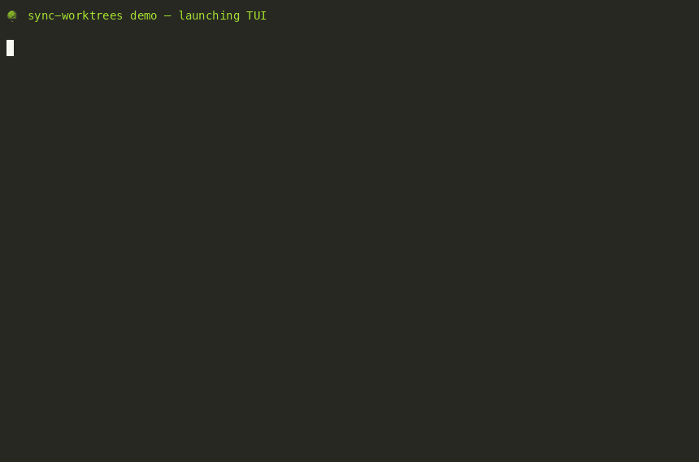

# sync-worktrees

> Keep every branch and every repo you work on checked out as predictable directories — no stashing, no re-cloning, no re-orienting your AI assistant.



**Contents:** [Why](#why-sync-worktrees) · [How it works](#how-it-works) · [Quick start](#quick-start) · [MCP server](#mcp-server) · [Interactive TUI](#interactive-tui) · [CLI options](#cli-options)

## Why sync-worktrees

If you've ever:

- Stashed half-finished work just to check out another branch
- Lost minutes hunting for where you cloned a sibling repo
- Switched branches in five repos because one feature spans them all
- Re-explained to an AI assistant which directory holds which branch

…sync-worktrees fixes that. It keeps the **entire branch and repo layout you work in materialized on disk** — one directory per branch, automatically kept in sync with the remote. Switching branches becomes `cd`. Searching across repos becomes `grep -r`. **AI agents see the same shape you do, so "look in the other repo" actually works.**

It's also a clean answer to **dev-environment bootstrapping**. One config file describes every repo, branch, and folder layout your team works in. Hand it to a new hire (or a fresh laptop) and `sync-worktrees` lays down the whole workspace in a single command — no day-one cloning checklist, no "where do I put this repo?" Slack threads.

Runs as a one-shot, a background daemon, or an interactive TUI — and ships an MCP server so AI assistants can list, create, and inspect worktrees themselves.

## How it works

The default — **worktree mode** — gives every remote branch its own directory while sharing one Git database underneath:

1. **First run** clones the repo once as a bare repository (just the Git data, no working files).
2. **Each sync**:
   - Creates a directory for every remote branch (`main`, `develop`, `feature/*`).
   - Fetches latest changes (no merge — your local work stays untouched).
   - Removes directories for branches deleted upstream (preserves dirty trees and unpushed commits).

The bare repository is not an extra object store layered on top — it is the single Git database every worktree attaches to natively, so branches share history for free (no `--reference`, no alternates). The bare layout exists only so that no branch is a privileged "main" checkout: every branch, the default included, is a peer directory.

Smallest config that produces this:

```javascript
// sync-worktrees.config.js
// @ts-check

/** @satisfies {import("sync-worktrees").SyncWorktreesConfig} */
const config = {
  repositories: [
    {
      name: "my-repo",
      repoUrl: "https://github.com/user/my-repo.git",
      worktreeDir: "./worktrees/my-repo",
    },
  ],
};

export default config;
```

Run `sync-worktrees` from the directory holding the config and you get:

```
.
├── sync-worktrees.config.js
├── .bare/
│   └── my-repo/             # Bare repository (shared Git objects)
└── worktrees/my-repo/
    ├── main/                # Worktree for main branch
    ├── feature-1/           # Worktree for feature-1 branch
    └── feature-2/           # Worktree for feature-2 branch
```

**Clone mode** (`mode: "clone"`) is a first-class alternative: a plain `git clone` of one branch into `worktreeDir`, no bare repo, no per-branch subfolders. Reach for it when you want a repo to live at a fixed path — a dependency sibling, a single-branch dev clone, or any case where one checkout is enough. See [Clone mode](#clone-mode).

## Features

- **Filtering & lifecycle** — branch name globs, age filtering, sparse checkout, automatic divergence detection with `.diverged/` preservation, retry with exponential backoff.
- **Interactive TUI** — Ink-based UI with wizards for opening worktrees, creating branches, and inspecting status; diverged-directory management; live log streaming; multi-repo filtering.

## Installation

```bash
npm install -g sync-worktrees
```

## Quick start

`sync-worktrees` always runs against a config file. Create one once, then run the tool.

```bash
cd ~/projects/my-sync-dir
sync-worktrees init      # interactive wizard → writes sync-worktrees.config.js
sync-worktrees           # auto-loads the config in the current directory and starts syncing
```

By default, bare `sync-worktrees` launches the [interactive TUI](#interactive-tui), syncs once straight away, then keeps syncing on the cron schedule from your config — so a fresh `init` gives you worktrees now rather than at the top of the next hour. Set `defaults.syncOnStart: false` to leave the first sync to the schedule. Press `q` to quit. For a one-shot run (CI, scripts, ad-hoc), add `--runOnce`.

To manage multiple repositories, edit the generated config file and add entries under `repositories`. See [Configuration](#configuration).

Discovery tries `sync-worktrees.config.js`, `.mjs`, `.cjs` and `.ts`, in that order — the CLI in the current directory, the MCP server walking up from it. A `.ts` config is run by Node directly, with no build step, so it must use erasable syntax only (no `enum`, `namespace`, parameter properties or decorators). `init` writes `.js`, which is already type-checked through its `@satisfies` JSDoc.

If the config lives outside the current directory, pass it explicitly:

```bash
sync-worktrees --config /path/to/sync-worktrees.config.js
sync-worktrees --config /path/to/sync-worktrees.config.js --runOnce
sync-worktrees list --config ./config.js --filter "frontend-*"
```

## MCP server

sync-worktrees ships a [Model Context Protocol](https://modelcontextprotocol.io) server so AI assistants (Claude Desktop, Claude Code, Cursor, Windsurf, etc.) can inspect and operate your workspace directly. Installing the package exposes a second binary, `sync-worktrees-mcp`, that speaks MCP over stdio.

In a single call, an AI assistant can discover every repo and worktree you have configured — so an agent working in `frontend/` can grep across `backend/` and `shared/` without you reorienting it. That call is `detect_context` with `includeAllWorktrees: true`; the response also includes a per-capability `{ available, reason }` block telling the agent which operations are reachable from its current vantage point, so there's no guessing whether `sync` will work. See [Available tools](#available-tools) for the full surface.

### Getting started

Install the sync-worktrees MCP server with your client.

**Standard config** works in most tools:

```json
{
  "mcpServers": {
    "sync-worktrees": {
      "command": "npx",
      "args": ["-y", "-p", "sync-worktrees", "sync-worktrees-mcp"],
      "env": {
        "SYNC_WORKTREES_CONFIG": "/absolute/path/to/sync-worktrees.config.js"
      }
    }
  }
}
```

If installed globally, replace `command` with `sync-worktrees-mcp` and drop `args`. `SYNC_WORKTREES_CONFIG` is optional — without it the server runs in **auto-detect mode**: when the client's CWD sits inside a worktree managed by sync-worktrees, the server locates the bare repo, enumerates sibling worktrees, and enables per-worktree operations. `sync` and `initialize` require the repository to be listed in a loaded config (or call `load_config` at runtime); they stay unavailable for auto-detected repositories no matter which other tools have run.

<details>
<summary>Claude Code</summary>

Use the Claude Code CLI:

```bash
claude mcp add sync-worktrees -- npx -y -p sync-worktrees sync-worktrees-mcp
```

To pass a config path, append `-e SYNC_WORKTREES_CONFIG=/absolute/path/to/sync-worktrees.config.js` to the command.

</details>

<details>
<summary>Claude Desktop</summary>

Edit `claude_desktop_config.json` and paste the **standard config** above into the `mcpServers` block. Default locations:

- macOS: `~/Library/Application Support/Claude/claude_desktop_config.json`
- Windows: `%APPDATA%\Claude\claude_desktop_config.json`

Restart Claude Desktop after editing.

</details>

<details>
<summary>Cursor</summary>

Edit `~/.cursor/mcp.json` (global) or `.cursor/mcp.json` (per-project). Paste the **standard config** above.

Or open `Cursor Settings` → `MCP` → `Add new MCP Server`, pick `command` type, and enter `npx -y -p sync-worktrees sync-worktrees-mcp`.

</details>

<details>
<summary>Windsurf</summary>

Follow the Windsurf MCP [documentation](https://docs.windsurf.com/windsurf/cascade/mcp) and use the **standard config** above.

</details>

<details>
<summary>VS Code</summary>

Use the VS Code CLI:

```bash
code --add-mcp '{"name":"sync-worktrees","command":"npx","args":["-y","-p","sync-worktrees","sync-worktrees-mcp"]}'
```

Or follow the VS Code MCP install [guide](https://code.visualstudio.com/docs/copilot/chat/mcp-servers#_add-an-mcp-server) and use the **standard config** above.

</details>

<details>
<summary>Codex</summary>

Use the Codex CLI:

```bash
codex mcp add sync-worktrees -- npx -y -p sync-worktrees sync-worktrees-mcp
```

Or edit `~/.codex/config.toml`:

```toml
[mcp_servers.sync-worktrees]
command = "npx"
args = ["-y", "-p", "sync-worktrees", "sync-worktrees-mcp"]
```

</details>

<details>
<summary>Gemini CLI</summary>

Follow the Gemini CLI MCP install [guide](https://github.com/google-gemini/gemini-cli/blob/main/docs/tools/mcp-server.md#configure-the-mcp-server-in-settingsjson) and use the **standard config** above.

</details>

<details>
<summary>Cline</summary>

Edit `cline_mcp_settings.json` (see [Configuring MCP Servers](https://docs.cline.bot/mcp/configuring-mcp-servers)) and add:

```json
{
  "mcpServers": {
    "sync-worktrees": {
      "type": "stdio",
      "command": "npx",
      "args": ["-y", "-p", "sync-worktrees", "sync-worktrees-mcp"],
      "disabled": false
    }
  }
}
```

</details>

<details>
<summary>opencode</summary>

Edit `~/.config/opencode/opencode.json`:

```json
{
  "$schema": "https://opencode.ai/config.json",
  "mcp": {
    "sync-worktrees": {
      "type": "local",
      "command": ["npx", "-y", "-p", "sync-worktrees", "sync-worktrees-mcp"],
      "enabled": true
    }
  }
}
```

</details>

<details>
<summary>Warp</summary>

Open `Settings` → `AI` → `Manage MCP Servers` → `+ Add` (see [Warp MCP docs](https://docs.warp.dev/knowledge-and-collaboration/mcp#adding-an-mcp-server)) and paste the **standard config** above. Alternatively, run `/add-mcp` in the prompt.

</details>

### Available tools

| Tool                     | Purpose                                                                                                                                                                                                                           |
| ------------------------ | --------------------------------------------------------------------------------------------------------------------------------------------------------------------------------------------------------------------------------- |
| `detect_context`         | Inspect a path, resolve the bare repo, enumerate sibling worktrees, report config-driven sibling repositories and capabilities. Pass `includeAllWorktrees: true` to include every configured repo's worktrees keyed by repo name. |
| `list_worktrees`         | List worktrees with status label (`clean`/`dirty`/`stale`/`current`), divergence, `safeToRemove`, last sync. Without `repoName` and with a loaded config, results are grouped across all configured repos.                        |
| `get_worktree_status`    | Detailed status for one worktree (dirty files, unpushed commits, stashes, operation in progress).                                                                                                                                 |
| `create_worktree`        | Create a worktree for a branch; optionally create the branch from `baseBranch`. Newly created branches are pushed to origin unless `push=false`. `worktreeExisted` is true when the worktree was already there (a no-op retry).   |
| `update_worktree`        | Fast-forward one worktree to match upstream. `updated` is false when there was nothing to merge.                                                                                                                                  |
| `sync`                   | Full sync cycle (fetch, create, prune, update). Requires config. Streams progress notifications. `success` is false (with `failed`/`failures` listed) when any action failed, matching the CLI's exit code 1.                     |
| `initialize`             | Clone the bare repo and create the main worktree. Requires config. Streams progress.                                                                                                                                              |
| `load_config`            | Load or reload a config file at runtime.                                                                                                                                                                                          |
| `set_current_repository` | Select the active repo when multiple are configured.                                                                                                                                                                              |

All tools that target a single repo accept an optional `repoName`. When omitted, they use the current repository — set by auto-detect, by a config listing exactly one repository, or by `set_current_repository`. With several repositories configured and none of those in force, the call fails and names the repositories to choose from rather than picking one.

Arguments are validated strictly: a key no tool declares is rejected by name (`Unrecognized key: "repo_name"`) rather than dropped, so a snake_case or misspelled `repoName` fails loudly instead of silently targeting the current repo.

### Safety

- The MCP surface exposes no removal or trash operations — an agent cannot delete a worktree or touch the trash through it. Removal happens via sync's own safety-gated pruning or manual git commands.
- `create_worktree` rejects sanitized-path collisions (e.g. `feature/foo` vs `feature-foo` both resolving to `feature-foo/`) before touching disk, and errors with code `TARGET_EXISTS` when its target directory already exists but is not a registered worktree — it never moves an existing directory to trash or deletes it (clean the path up manually or let `sync` reconcile it).
- `sync` prunes every worktree outside the filtered branch set, so `create_worktree` refuses one it would take away again: `BRANCH_FILTERED` for a branch `branchInclude`/`branchExclude`/`branchMaxAge` exclude (`force: true` overrides), and a `warning` for a local-only branch until it is pushed.
- Branches created by sync-worktrees use `--no-track` first, then publish with `git push -u origin <branch>`, so they do not inherit `origin/main` as their upstream.
- Path-targeted tools verify the supplied path is a registered worktree of the selected repository.
- `update_worktree` errors with code `DETACHED_HEAD` when the worktree has no branch checked out: there is nothing for a fast-forward to move, and the message names the path and the commit HEAD sits on. Check a branch out there and call it again.

## Interactive TUI

Running `sync-worktrees` without `runOnce` drops you into an interactive terminal UI with live log streaming, manual sync triggers, and wizards for the common operations. It syncs once on startup (see `defaults.syncOnStart`) and then on the cron schedule; `s` triggers the same cycle by hand. Only one cycle runs at a time: a tick or an `s` that lands on one already running says so in the log and skips.

### Keybindings

| Key         | Action                                         |
| ----------- | ---------------------------------------------- |
| `s`         | Manually trigger sync for all repositories     |
| `c`         | Create a new branch (wizard)                   |
| `o`         | Open a worktree in terminal or editor (wizard) |
| `w`         | View worktree status across repos              |
| `x`         | Force clean trash, recovery refs, and objects  |
| `r`         | Reload configuration and re-sync               |
| `?` / `h`   | Toggle help screen                             |
| `q` / `Esc` | Gracefully quit                                |
| `j` / `↓`   | Scroll log down one line                       |
| `k` / `↑`   | Scroll log up one line                         |
| wheel       | Scroll the log (hold `Shift` to select text)   |
| `gg`        | Jump to top of log                             |
| `G`         | Jump to bottom (re-enables auto-scroll)        |

### Wizards

- **Open wizard (`o`)** — select a worktree across all configured repos with live filtering (just type to narrow the list). Press `Tab` to flip between **Terminal** mode (launches a new terminal window attached to a `tmux` session in the worktree) and **Editor** mode (launches `$EDITOR` / `$VISUAL`, falling back to `code`). Re-opening the same worktree attaches to the existing tmux session instead of creating a duplicate.
- **Branch creation wizard (`c`)** — pick a repo, pick a base branch from a live-filtered list, type the new branch name. Names are validated against Git's rules; if the desired name already exists, a numeric suffix (`-2`, `-3`, …) is suggested automatically.
- **Worktree status view (`w`)** — flat list of every worktree across every configured repo, each tagged with status flags:

  | Flag | Meaning                                                                                                       |
  | ---- | ------------------------------------------------------------------------------------------------------------- |
  | `✓`  | Clean                                                                                                         |
  | `M`  | Modified / uncommitted changes                                                                                |
  | `↑`  | Unpushed commits                                                                                              |
  | `⇡`  | Commits absent from every remote but fully pushed before the remote branch was deleted (likely squash-merged) |
  | `S`  | Stashed changes                                                                                               |
  | `⚠` | Operation in progress (merge/rebase/cherry-pick/revert/bisect)                                                |
  | `⊞`  | Modified submodules                                                                                           |
  | `✗`  | Upstream branch is gone                                                                                       |

  Press `Enter` on an entry to expand file/commit/stash counts. The view also surfaces `.diverged/` directories preserved from past force-pushes; press `d` (with `y`/`n` confirmation) to delete one after reviewing.

### Terminal mode environment variables

| Variable                  | Purpose                                                                                                                                                                    | Default behavior                                                            |
| ------------------------- | -------------------------------------------------------------------------------------------------------------------------------------------------------------------------- | --------------------------------------------------------------------------- |
| `SYNC_WORKTREES_TERMINAL` | Override the terminal launcher on any platform. Value is a command string; the tmux invocation is appended via `sh -c`. Example: `SYNC_WORKTREES_TERMINAL="alacritty -e"`. | See per-platform defaults below.                                            |
| `TERMINAL`                | Linux-only fallback when `SYNC_WORKTREES_TERMINAL` is unset. Same format.                                                                                                  | Probes `gnome-terminal`, `konsole`, `alacritty`, `kitty`, `xterm` in order. |
| `EDITOR` / `VISUAL`       | Editor mode launcher.                                                                                                                                                      | Falls back to `code`.                                                       |

Per-platform terminal defaults (when no env override is set):

- **macOS** — Ghostty if `Ghostty.app` is installed, otherwise Terminal.app via AppleScript.
- **Linux** — `$TERMINAL` if set; otherwise the first found among the candidates above.

Terminal mode requires [`tmux`](https://github.com/tmux/tmux) to be installed.

## Configuration

Config files are JavaScript modules — ES modules by default, CommonJS when the file is `.cjs` or the nearest `package.json` declares `"type": "commonjs"` (`module.exports = config;` instead of `export default config;`). `sync-worktrees init` picks the right one for you. Relative paths resolve from the config file's location, and you have full access to `process.env` and Node module loading.

Splitting a config across several files is supported, including on reload: reloading (`r` in the interactive UI, the `load_config` MCP tool) re-reads the config file **and** every module it pulls in, so editing `./repos.js` and pressing `r` picks up the change without restarting. A reload re-evaluates the config on a worker thread to get that fresh read, so the value a config file exports has to be plain data — strings, numbers, booleans, arrays, objects, and also `Date`, `RegExp`, `Map`, `Set` and `BigInt`. A function cannot cross that boundary, and neither can a symbol, a `WeakMap` or a `Proxy`; no setting takes any of them (`hooks.onBranchCreated` and the branch filters are arrays of strings), and a reload that finds one fails with a message naming the value, leaving the previously loaded config running.

### Minimal config

```javascript
// @ts-check

/** @satisfies {import("sync-worktrees").SyncWorktreesConfig} */
const config = {
  repositories: [
    {
      name: "my-project",
      repoUrl: "https://github.com/user/my-project.git",
      worktreeDir: "./worktrees/my-project",
    },
  ],
};

export default config;
```

### Multi-repo config

```javascript
// @ts-check

/** @satisfies {import("sync-worktrees").SyncWorktreesConfig} */
const config = {
  defaults: {
    cronSchedule: "0 * * * *", // hourly
    branchMaxAge: "30d", // ignore stale branches
    branchExclude: ["wip-*", "tmp-*"],
    updateExistingWorktrees: true,
  },

  // Every field here is an override: left out, `retry` gives 3 attempts, a 1s
  // initial delay and a 30s cap. See "Retry and LFS" for the full table.
  retry: {
    maxAttempts: "unlimited", // keep retrying a flaky remote instead of stopping at 3
    initialDelayMs: 1000,
    maxDelayMs: 600000, // 10 minutes
    backoffMultiplier: 2,
  },

  repositories: [
    {
      name: "frontend",
      repoUrl: "https://github.com/company/frontend.git",
      worktreeDir: "./worktrees/frontend",
      cronSchedule: "*/30 * * * *", // override default
    },
    {
      name: "backend",
      repoUrl: process.env.BACKEND_REPO_URL || "https://github.com/company/backend.git",
      worktreeDir: "/absolute/path/backend-worktrees",
      branchMaxAge: "6m",
      branchInclude: ["feature/*", "release-*", "main"],
      retry: { maxAttempts: 10 }, // per-repo override
    },
  ],
};

export default config;
```

Notes:

- `bareRepoDir` defaults to `.bare/<repo-name>` if not specified.
- If the bare repository at `bareRepoDir` already exists, its `origin` must be `repoUrl` (compared ignoring `.git`, a trailing slash and scheme/host case); otherwise initialization fails naming both URLs. Run `git -C <bareRepoDir> remote set-url origin <repoUrl>` or point `bareRepoDir` at a fresh directory.
- Every entry needs its own directories: two entries that resolve to the same `worktreeDir` (in either mode) or the same `bareRepoDir`, or whose `worktreeDir` sits at or inside another entry's `bareRepoDir` (or vice versa), are rejected when the config loads, naming both entries and the path. A `worktreeDir` nested inside another entry's `worktreeDir` loads with a warning.
- Repository-specific settings override `defaults`.
- `defaults.syncOnStart` (default `true`) runs one sync as soon as the daemon starts, before the first cron tick — the same cycle a tick would run, so a restart after a config change takes effect immediately instead of a schedule period later. Set it to `false` to wait for the schedule. Like `runOnce` it is a whole-file setting: one process runs every repository, so setting it on a repository entry is a validation error. It has no effect under `runOnce`, which already syncs once and exits.

### Authentication

sync-worktrees runs every git command non-interactively — as a daemon, a cron tick, the MCP server or the TUI, nobody can answer a prompt — so it sets `GIT_TERMINAL_PROMPT=0` — unless you have exported that variable yourself, which is left alone so `--runOnce` in a terminal can still prompt. Credentials must come from a source that needs no prompt:

- **HTTPS** — a git credential helper (`git config --global credential.helper <helper>`, or your platform's keychain / credential manager) that already holds credentials for the remote. An askpass program (`GIT_ASKPASS`, `core.askPass`) keeps working. A remote that would prompt fails within a second with git's message plus a hint naming the fix, and that failure is not retried.
- **SSH** — a key loaded into `ssh-agent` (or one without a passphrase) and the host already present in `~/.ssh/known_hosts`. A key the remote rejects or a host key that does not match fails at once with a hint and is not retried. Known limitation: `GIT_TERMINAL_PROMPT=0` covers git's own prompts only; ssh reads a key passphrase or an unknown-host confirmation from the terminal itself, so a passphrase-protected key without an agent or a host missing from `known_hosts` still blocks until the fetch inactivity timeout (unchanged from earlier releases). sync-worktrees does not set `GIT_SSH_COMMAND`, because git gives it precedence over the `core.sshCommand` config key; a `core.sshCommand`-aware `BatchMode` wrapper is a follow-up.

### Clone mode

Set `mode: "clone"` to clone one checked-out branch directly into `worktreeDir` instead of maintaining one worktree per remote branch:

```javascript
{
  name: "game-platform",
  repoUrl: "ssh://git@example.com/game-platform.git",
  worktreeDir: "./slots/game-platform",
  mode: "clone",
  branch: "main",
  depth: 1,                            // optional shallow clone
}
```

Clone mode keeps only the checked-out branch materialized as a local `origin/*` ref. Branch discovery uses remote metadata, so the tool can list remote branches without downloading object closure for every branch tip. `branch` controls the checked-out branch that sync-worktrees fast-forwards on each sync. Omit `branch` and the remote HEAD is resolved at clone time.

`depth` is valid only for clone-mode repositories and must be a positive safe integer. It applies to the initial `git clone --single-branch --no-tags --depth <N>`, and to every routine sync fetch as a **ratcheted cap**: `--depth max(depth, the window the clone already holds under origin/<branch>)`. The cap is there because a shallow clone has no ancestors to offer the server as `have`s — once the remote tip stops being a descendant of the clone's tip, which a force-push or a rebase does, an uncapped fetch has to pack the new tip's whole ancestry. The ratchet is there because `git fetch --depth N` re-applies N to the ref it fetches rather than capping at it: the configured value passed verbatim took a clone that had just been deepened straight back to one commit, which cut the parent link needed to tell a fast-forward from a divergence, so every remote advance bought another 50-commit deepen that the next tick threw away.

Both numbers are **ancestry levels**, counted from the ref the fetch re-applies them to. `--depth N` keeps every commit within N parent steps of the fetched tip, so on a merge-built history one level holds several commits — a 50-level fetch of a remote whose pull requests land as two-commit merges produced a 147-commit clone. The clone is therefore measured in levels rather than commits (a count is the larger number, and feeding it back walks the boundary deeper every tick until the clone is complete and `depth` bounds nothing), and measured from `origin/<branch>` with a local `git rev-list --topo-order --parents` walk rather than from HEAD — HEAD is the tip a fetch re-applies its depth from only on a tick that ends in a fast-forward, and on a tick that fetches and then skips the merge (dirty worktree, unpushed commits, a divergence) it lags behind, so a cap measured there asks for less than the clone holds and cuts it back, further on every tick. Measured from the fetched ref the cap is a fixed point instead: the window a `--depth D` fetch produced measures back as exactly D, so history widens only when the deepen budget or a raised `depth` widens it. (HEAD is the fallback for a first sync, before `origin/<branch>` exists.)

What the cap costs and buys, all measured on git 2.43. Against a 199-commit remote that force-pushed (`reset --hard HEAD~3` plus one commit, leaving a 197-commit tip), a `depth: 1` clone fetched 1 commit in a 3-object pack with the cap and all 197 in a 201-object pack without it — classified `indeterminate_shallow` either way, so the uncapped download bought nothing. (That remote is empty commits over a three-file seed, so the 201 is 197 commits, the three trees the clone lacked and the one blob the rewrite added; commits carrying content add a tree and a blob apiece to it.) Against a 601-commit remote advancing by one merged pull request per tick: one deepen to 50 levels (147 commits), then `--depth 50` and 6 objects per tick, `fast_forward` on the first classification, still 147 commits and still shallow six ticks later. Against a 120-commit remote advancing three commits a tick with the worktree left dirty for five ticks, so every tick fetched and skipped the merge: the window held at the 50 levels the deepen bought and the first clean tick fast-forwarded without deepening again — where the same run measured from HEAD sent `--depth` 50, 47, 41, 32, 20, 5 and had to buy the window back. A clone does not sit at exactly `depth`, though: a remote k levels ahead pushes the oldest k levels off the bottom, and a tip a force-push moved off the fetched ref's ancestry cannot be held inside the window by any depth. A clone that is not shallow gets no `--depth` at all, since there the flag would *make* it shallow — `--depth 5` against a full 199-commit clone left 5 commits.

Editing `depth` reaches an existing clone, asymmetrically. Raising it raises the cap, so the next sync fetch deepens a shorter clone up to the new value — with `depth` raised from 1 to 10, the next fetch took a one-commit clone to 10. Raising it also **shrinks the deepen budget**, which only uses targets above `depth`: at 1000 or more there is no budget left, and a clone that cannot be classified can then only be skipped. Lowering `depth` cannot shorten an existing clone through the sync fetch, which takes the larger of the two. Removing `depth` changes an existing clone wholesale: the next sync unshallows it with `git fetch --unshallow --no-tags`, which is also the remedy when a sync reports it cannot classify the tracked branch.

Two other fetches re-apply the configured value verbatim, and `--depth` below the current depth shortens:

- The in-sync deepen budget (below) refetches at `--depth 50`, `200` or `1000` when it cannot classify the tracked branch, so a clone grown past the target it picks is cut back to it (80 commits went to 50) — and when the budget cannot settle the question either, because a force-push moved the branch off the clone's tip entirely, that repeats every tick until the divergence is resolved.
- Switching the clone to another branch from the TUI, and the branch wizard's base-branch fetch, re-apply `depth` to whatever ref they name. The shallow boundary is repository-wide, so those can shorten **or** deepen the clone whether or not you edited `depth` — including when the ref is the tracked branch itself, which the wizard offers among the bases: a clone the deepen budget had grown to 50 commits went back to 1 on a `--depth 1` base fetch of it. The flag stays there because dropping it is ruinous for the case it exists for, a branch with a tip of its own the clone has never seen: fetching a 290-commit branch (this one built from commits that each rewrite a file) into a `depth: 1` clone cost 288 of them — all but the two the clone's existing shallow graft already hid — in an 861-object pack without `--depth`, against 1 commit and 3 objects with it.

Clone mode rejects `branchInclude`, `branchExclude`, `branchMaxAge`, `updateExistingWorktrees`, and `bareRepoDir` at validation time (whether set directly or inherited via `defaults`) — they have no meaning for a single-branch checkout.

### Sparse checkout

For monorepos where you only need a subset of folders, set `sparseCheckout` per repository entry. The tool runs `git worktree add --no-checkout`, configures sparse-checkout, then materializes only the included paths. The same repository URL can be listed multiple times under different `name`s with different sparse patterns to build domain-grouped layouts.

```javascript
// @ts-check

/** @satisfies {import("sync-worktrees").SyncWorktreesConfig} */
const config = {
  repositories: [
    {
      name: "roulette-game-client",
      repoUrl: "https://github.com/acme/casino-monorepo.git",
      worktreeDir: "/Users/me/game-clients/roulette",
      sparseCheckout: { include: ["game-client"] },
    },
    {
      name: "roulette-autocue",
      repoUrl: "https://github.com/acme/casino-monorepo.git",
      worktreeDir: "/Users/me/autocues/roulette",
      sparseCheckout: { include: ["autocue"] },
    },
  ],
};

export default config;
```

**Modes:**

- `cone` (default): pass folder names in `include`. Fast and recommended.
- `no-cone`: pass gitignore-style patterns including `!negation`. Required for `exclude` and any `!`-prefixed include.

If you set `exclude` or `!`-prefixed patterns while `mode: "cone"` is explicit, the tool auto-promotes to `no-cone` and logs a warning.

Cone-mode `include` entries are checked at load against the rules `git sparse-checkout set --cone` enforces — no leading slash, no `*`, `?`, `[` or `]`, and nothing climbing above the repository root with `..` — so `include: ["/apps/web"]` is a config error naming the repository, the entry and the fix rather than a `worktree add` and rollback per branch on every tick. Directories are judged in the form git receives them, after the trailing slash, `./`, `..` and repeated-slash normalization the tool already applies, so `apps/web/` and `./apps/web` are fine. `no-cone` patterns are left alone: a slash and a glob mean something there.

**Duplicate `repoUrl` handling:** The first entry per `repoUrl` keeps the URL-derived bare path (`.bare/<repo-slug>`). Subsequent duplicate entries auto-derive `bareRepoDir` from `name` (`.bare/<name>`). Pin `bareRepoDir` explicitly on duplicate entries if you want config order to be irrelevant.

**Narrowing safety:** When a sync would narrow an existing worktree's sparse patterns (remove a previously included path), it first checks the worktree is clean. If there are uncommitted changes, unpushed commits, or in-progress operations, the sparse update is skipped with a warning and reattempted on the next sync. Clone mode applies the same uncommitted-and-untracked-changes check that gates its fast-forward; unpushed commits are reported there as a skip of their own. The check compares the new patterns against the ones already in force, so it does not apply to a checkout that is not sparse yet — giving an existing full checkout a `sparseCheckout` block narrows it on the next sync whether or not the tree is clean, in both modes. If Git rejects the pattern list outright, the sparse step is recorded as a failed action, so a `--runOnce` run exits non-zero rather than warning and moving on — unless the tree was dirty and the change narrows, in which case the skip above comes first and the rejection is not discovered until a run finds the tree clean.

### Maintenance

Over time a repository accumulates unreachable Git objects — clone mode leaves them behind when single-branch fetches narrow refs, and both modes churn objects as branches come and go. The optional `maintenance` block runs `git gc` periodically to reclaim that storage and consolidate pack files. It applies to both modes and runs at the tail of a successful sync, under the same repository operation lock as the sync itself (so it never races a fetch, merge, or worktree operation).

```javascript
defaults: {
  maintenance: {
    enabled: true,      // default: true
    interval: "7d",     // default: "7d" — minimum time between runs
    aggressive: false,  // default: false
  },
}
```

- **`interval`** is a duration string (`h`/`d`/`w`/`m`/`y`). The last run is timestamped in the object store (`<bare-repo>/sync-worktrees-maintenance.json`, or `<worktreeDir>/.git/…` in clone mode), so throttling survives daemon restarts and repeated `runOnce` invocations.
- **`aggressive: false`** (default) runs plain `git gc`, which honors Git's two-week grace period — recently-unreachable objects (and anything reachable from a branch, tag, stash, or reflog) are always preserved.
- **`aggressive: true`** runs `git gc --prune=now`, pruning recently-unreachable objects immediately. Use it only for explicit reclamation; the default is the safe choice. The repository operation lock only serializes sync-worktrees' own operations — `--prune=now` can still race manual `git` work happening in the checkout outside the daemon, so avoid enabling it on repositories you also edit by hand concurrently. Every worktree shares the bare repository's object store, so this applies to work in any of them, not just the one you are looking at.
- A maintenance failure is logged as a warning and never fails the sync. The attempt is still timestamped, so a broken `gc` is throttled instead of retried every tick.

### Locking

Every sync runs under a cross-process repository lock, so a cron daemon, a `--runOnce` from a shell and the MCP server never operate on the same checkout at once. A run that finds the lock held is skipped with a warning; a run that cannot create or take the lock fails and names the path and errno.

The lock file lives next to the checkout, in `<parent of worktreeDir>/.sync-worktrees-locks/<hash>.lock`, with `worktreeDir` resolved through symlinks first. Nothing in the environment feeds into that path: a daemon started by systemd, launchd or cron with a minimal environment, a shell whose dotfiles export `XDG_STATE_HOME`, and `sudo` with or without `-E` all contend for the same file as long as they point at the same `worktreeDir`. Worktree-mode repositories additionally lock the bare repository directory. Locks are never placed under `~/.cache` or inside `worktreeDir` itself.

`SYNC_WORKTREES_LOCK_DIR` moves the lock files to another directory — for a checkout whose parent directory is read-only, for instance. It is an escape hatch, not a preference: give it the same absolute path in every process that syncs the same `worktreeDir`, otherwise those processes stop contending for one lock.

### Branch filtering

Two filters can be combined:

```javascript
defaults: {
  branchInclude: ["feature/*", "release-*", "main"],
  branchExclude: ["feature/wip-*"],
  branchMaxAge: "30d",
}
```

- **Name patterns** support `*` wildcards (including across `/`): `feature/*` matches `feature/login` and `feature/auth/oauth`.
- **`branchInclude`** keeps only matching branches; **`branchExclude`** removes matching branches. When both are set, include runs first, then exclude.
- **`branchMaxAge`** drops branches whose latest commit is older than the duration (`h`/`d`/`w`/`m`/`y` — e.g. `24h`, `30d`, `6m`, `1y`). Applied after name filtering.
- The default branch is always retained regardless of filters.
- Filters define the managed branch set. An existing managed worktree that no longer matches a filter is handled like a removed remote branch and is safety-checked, then moved to trash when removable.

### Diverged branches

When upstream is force-pushed and your worktree contains divergent local commits, sync-worktrees moves the worktree to a hidden `.diverged/` directory before creating a fresh one from the new upstream. No data loss; you can review the old state later.

```
my-repo-worktrees/
├── main/
├── feature-a/
└── .diverged/
    └── 2024-01-15-feature-x/
        ├── .diverged-info.json
        └── [all your local files]
```

Reviewing a diverged worktree:

```bash
cd my-repo-worktrees/.diverged/2024-01-15-feature-x
git diff origin/feature-x

# keep local: git push --force-with-lease
# discard: use `d` on the entry in the TUI worktree status view
```

The TUI's worktree status view (`w`) lists diverged directories and offers a guided delete (`d` with `y`/`n` confirmation) once you've decided.

Clean rebases where file content matches the upstream are auto-applied with no detour through `.diverged/`. Diverged-but-no-local-commits is also handled without preservation, since there's no user work to keep.

With trash enabled (the default), the preserved copy lands in `.trash/` instead of `.diverged/`, so it ages out under the retention policy and can be restored as a full worktree — see [Trash and restore](#trash-and-restore). The `.diverged/` layout above applies when trash is disabled.

### Trash and restore

Every managed-worktree removal — including age/filter pruning, exact stale-target replacement, and diverged-branch replacement — is reversible by default. Unknown top-level directories are never inferred to be owned by sync-worktrees and are left untouched.

```
my-repo-worktrees/
├── main/
├── feature-a/
└── .trash/
    └── 2026-06-06T18-30-00-000Z-feature-x-a1b2c3/
        ├── manifest.json     # branch, reason, original path, HEAD commit, expiry
        └── payload/          # the directory exactly as it was, including uncommitted work
```

When the removed directory was a branch worktree, a pin ref (`refs/sync-worktrees/trash/<workspace-hash>/<id>`) keeps the trashed HEAD's objects alive through `git gc` for the whole retention window — even though the local branch ref itself is deleted after trashing. Each entry expires on its own clock; maintenance runs the reaper after every sync attempt, including failed attempts.

```javascript
defaults: {
  trash: {
    enabled: true,        // default: true — disabling restores direct deletion
    retentionDays: 30,    // default: 30
    warnSizeBytes: 5e9,   // optional: warn when total trash exceeds this
    migrateLegacy: true,  // default: true — adopt old .removed/ and .diverged/ entries
  },
}
```

Trash entries are deliberately not exposed through the MCP server — listing, restoring, and purging are human operations.

In the TUI, press `x` to preview a force clean across every configured repository. Confirming with `y` deletes exactly the trash entries and permanent `refs/sync-worktrees/keep/*` recovery refs that preview counted, then runs `git gc`. This is irreversible; active worktree files, unrecognized trash content, and anything a sync trashed while the preview was on screen are left untouched — the last of these is reported in the result line.

The object store is the one thing every worktree does share, so the `gc` is the step that can reach work outside the trash you confirmed:

- The `gc` prunes on a one-hour grace window, not `--prune=now`, unless `maintenance.aggressive` opts into the latter. Prune expiry is measured from the mtime of the file currently holding an object, not from the age of the commit and not from when it stopped being reachable. A loose object carries its own mtime, so the commits behind a purged recovery ref are normally still collected on the same run; a packed object inherits its pack's mtime, and a repack resets that clock for everything in the new pack, so when the store has been repacked inside the window this run reclaims nothing and the next one past the hour does it instead. Objects written — or repacked — in the last hour wait, which is exactly where a concurrent `git commit` keeps the ones it has not yet anchored to a ref.
- Before the `gc`, each worktree's admin directory is checked for `index.lock` or `HEAD.lock` and for an unfinished `merge`, `rebase`, `cherry-pick`, `revert` or `bisect`. If any is found the `gc` is skipped for that repository, the result line reads `GC skipped`, and the errors name the worktree and the marker. This is a point-in-time check, not a lock: it catches a command or operation that is already in progress, and cannot stop one that starts a moment later. Purging the trash and refs still happens either way. A marker left behind by a crashed command — a stale `index.lock`, or a `rebase-merge/` from an operation nobody finished — keeps reporting busy until you remove the lock or finish the operation in that worktree; the error names both so you can tell which.

```bash
sync-worktrees trash --filter <repository-name>                                   # table of entries + keep refs
sync-worktrees trash --filter <repository-name> --json                            # the same listing, machine-readable
sync-worktrees trash --filter <repository-name> --restore <id>
sync-worktrees trash --filter <repository-name> --purge <id>                      # permanent, typed confirmation
sync-worktrees trash --filter <repository-name> --restore <id> --wait             # also valid with --purge
sync-worktrees trash --filter <repository-name> --dropKeepRef <listed-keep-name>
sync-worktrees trash --filter <repository-name> --dropAllKeepRefs
```

The listing is a table of `Id`, `Branch / path`, `Reason`, `Size`, `Expires`, `Restores as` and `Keep on reap`; an empty trash says so rather than printing nothing. `Size` reads `—` for a payload nothing has measured yet — sizes are gathered off the repository lock at the tail of a sync, so an entry trashed moments ago has none, and the listing never waits for a `du` of its own. `Restores as` is `worktree` when the entry still has its branch, HEAD commit and pin ref, and `files only` otherwise. `Keep on reap` marks an entry whose commits were on no remote when it was trashed; see **Permanent keep refs** below.

`--json` prints `{ entries, invalidEntries, keepRefs }`, where each entry carries `id`, `branch`, `reason`, `originalPath`, `deletedAt`, `expiresAt`, `sizeBytes` (`null` when unmeasured — never `0`), `restoresAsWorktree`, `keepPinOnReap` and `source`.

Expected failures — no entry with that id, a destination that already exists, a repository lock another process holds — print one `❌ <message>` line and exit 1; only an unexpected error prints a stack.

`--restore` and `--purge` take the repository lock, which a running daemon holds for the length of a sync. Without `--wait` they fail immediately and say so. With `--wait` they retry the lock for up to two minutes and then give up with the same message — a bound, not "block until it frees up", so a scripted invocation always terminates. Both locks a worktree-mode repository takes share that one window rather than getting it each.

`--purge <id>` deletes one entry ahead of its expiry, through the same path the expiry reaper uses: it needs an interactive TTY, the entry's id typed back, and it writes a `trash_purge` audit record before touching anything. For a `Keep on reap` entry the permanent `refs/sync-worktrees/keep/<id>` ref is created **first** and the files are deleted only if that succeeds — those commits are on no remote, so the payload and the pin can be the only copy in existence. Deleting the whole trash instead is the TUI's `x` (force clean), which also drops the recovery refs and runs a `gc`.

**Permanent keep refs**: a worktree whose commits were on no remote when it was pruned keeps them past payload expiry — when the entry is reaped, its pin is promoted to `refs/sync-worktrees/keep/<id>`, which nothing ages out. At reap time the question is asked again: if the commits are reachable from a remote-tracking ref by then, and this tick's `fetch --all --prune` completed so that ref set is current, no keep ref is minted. Anything less than that answer mints one — a failed fetch, a rev-list that failed, a count that could not be read.

That re-check is narrow, and is not a cure for keep refs accumulating. A squash or rebase merge puts the branch's *content* on the default branch as a new commit, so the original commits stay reachable from no remote ref and still earn a permanent ref — one per pruned branch, for as long as the repository lives. `--dropAllKeepRefs` is the way back: it lists what is there, takes one typed confirmation for the whole set, and deletes the refs it listed. Refs a `.diverged/` directory still relies on are retained and named, refs minted while the confirmation was on screen are left alone, and a ref another git process has locked is reported without stopping the rest. The commits behind a dropped ref become collectable by the next `git gc`.


**Restoring**: `sync-worktrees trash --filter <name> --restore <id>` puts the payload back at its original path. An entry the listing shows as `worktree` is rebuilt as a registered worktree on its branch; one shown as `files only` is restored as a plain directory, because without a pin ref the trashed commits may already be gone. That second case has a consequence worth knowing before you use it: if the branch is still in the repository's synced set, the next sync finds an unregistered directory where its worktree belongs and moves it straight back to trash as a new `orphan` entry. The warning on the restore says so; copy what you need out of the directory, or exclude the branch, before the next tick.

If you would rather do it by hand, read `manifest.json` for the entry's `branch`, `headOid`, and `originalPath`, then either copy `payload/` wherever you need the files, or rebuild the worktree yourself:

```bash
cd my-repo-worktrees/.trash/<id>
cat manifest.json
git -C <bare-repo> branch <branch> <headOid>
git -C <bare-repo> worktree add --no-checkout <originalPath> <branch>
cp -R payload/. <originalPath>/   # then restore the .git link git wrote:
git -C <bare-repo> worktree repair <originalPath>
git -C <originalPath> reset       # index at HEAD, payload shows as unstaged changes
```

Discarding one entry is `--purge <id>` (above), not `rm -rf`: removing the container by hand leaves its pin ref behind until the reaper's next sweep, and for a `Keep on reap` entry it destroys the only copy of commits that reached no remote.

Notes:

- Trash applies to worktree mode only; clone mode never removes its checkout.
- Anything in `.trash/` without a valid manifest is left alone by the reaper and reported, never deleted.
- A payload the process cannot delete — build output owned by another uid through a bind mount, a file carrying the immutable attribute — does not strand the entry. The payload is renamed to `payload.deleting-<timestamp>` inside the container before anything is removed, so the manifest survives a refused delete: the entry stays listed, every later run retries it, and the warning names the path that refused. Such an entry can no longer be restored (its payload is already on the way out); copy what you need out of the container by hand.
- Pin refs whose trash entry is gone (e.g. a failed cleanup, a manually emptied `.trash/`) are swept by the reaper on the next sync, so nothing stays pinned forever. The sweep only touches its own `<workspace-hash>/` namespace. Entries made before pins carried that namespace keep a flat `refs/sync-worktrees/trash/<id>` pin, which their own manifest still releases when the entry is restored or reaped; a flat pin whose entry was already gone by then is left alone — nothing distinguishes it from another workspace's — and has to be dropped by hand with `git update-ref -d`.
- A failure to move a directory into trash (e.g. trash on a different filesystem) skips the removal entirely — the worktree stays in place.
- Worktrees containing submodules are preserved byte-for-byte; nested submodule state is restored as-is but submodules are not re-registered automatically.

### Parallelism

`parallelism` bounds concurrent **git processes**, not worktrees. It can sit at the top level (as below), under `defaults`, or on a single repository — each layer overrides the one before it:

```javascript
parallelism: {
  maxRepositories: 2,      // repositories synced at once
  maxWorktreeCreation: 1,  // keep at 1 — git's worktree.lock makes parallel creation unsafe
  maxWorktreeUpdates: 3,
  maxWorktreeRemoval: 3,
  maxStatusChecks: 20,     // git processes spent on read-only status probes
  maxBranchFetches: 3,     // per-branch fetches, used only as a bulk-fetch fallback
}
```

One status check of a worktree runs up to nine git commands: `status`, `branch`, `branch -r`, `stash list` and `submodule status` all at once, then up to four `rev-parse`/`rev-list` probes together. All of them share a single `maxStatusChecks`-wide budget per repository, so a prune of 200 stale worktrees still peaks at `maxStatusChecks` git processes.

Two things sit outside that count. Git spawns children of its own — `git submodule status` runs a helper script and a child per submodule, measured on git 2.43 at roughly 1.5 git processes and 3 processes in total per call on an eight-submodule superproject — so a budget spent entirely on superproject probes costs about three times its size. And `maxWorktreeCreation`, `maxWorktreeRemoval` and `maxBranchFetches` each run their main git command through a single shared client whose scheduler stops at 5, so setting them higher than 5 buys little: the per-branch fetch fallback stops at 5 outright, while creation and removal grow a little past it for the few commands each unit runs on the worktree's own client. That fetch fallback only runs when a bulk fetch fails on LFS errors, and is left out of the peak entirely, so a config the loader reports as well inside the limit can still spawn about five fetches per repository if every repository hits the fallback at once.

A repository's phases run one after another — create, then prune, then update — so the whole run peaks at `maxRepositories × the widest single limit`, never their sum. The config loader rejects a config whose peak exceeds 100 git processes and names the setting to lower. The defaults peak at 2 × 20 = 40.

### Retry and LFS

A failed sync attempt is retried automatically, but only for errors a retry can fix: DNS failures, refused connections, timeouts, `EBUSY`, `Could not read from remote repository`, `fatal: unable to access`, and Git LFS failures. Everything else fails on the first attempt — the credential, ssh key and host key failures git names in its message (see [Authentication](#authentication)), `EACCES`, `EPERM`, `EROFS`, `ENOSPC`, and any error not on that list.

Leave `retry` out and a sync runs with these defaults:

| Setting             | Default | Meaning                                                                                                |
| ------------------- | ------- | ------------------------------------------------------------------------------------------------------ |
| `maxAttempts`       | `3`     | Attempts per sync, the first one included — so two retries. `"unlimited"` never stops retrying.        |
| `maxLfsRetries`     | `2`     | LFS failures tolerated before the sync ends with an LFS-specific error; also bounded by `maxAttempts`. |
| `initialDelayMs`    | `1000`  | Delay before the second attempt.                                                                       |
| `backoffMultiplier` | `2`     | Each delay multiplies the one before it: 1s, then 2s — 4s and 8s only once `maxAttempts` is raised.    |
| `maxDelayMs`        | `30000` | Ceiling on a single delay.                                                                             |
| `jitterMs`          | `0`     | Upper bound of a random extra delay — opt in when many repositories retry in lockstep.                 |

A `retry` block may sit at the top level, under `defaults` or on one repository, and the three merge field by field with the repository winning: `retry: { maxAttempts: "unlimited" }` keeps trying instead of stopping at three, `retry: { maxDelayMs: 60000 }` caps a single delay at a minute. When the attempts run out the sync fails — the daemon logs it and waits for the next cron fire, while `--runOnce` exits 1.

Two inactivity timeouts guard the git commands that talk to the remote: `fetchTimeoutMs` (default 5 minutes — `fetch`, `push`, `ls-remote`, `remote set-head`) and `cloneTimeoutMs` (default 15 minutes — the initial clone, and the `fetch --unshallow` that pulls a clone-mode repository's full history after `depth` is removed, which moves the same bytes a clone would). Each kills its command when no output arrives inside the window, so a stalled connection ends the attempt instead of hanging the sync forever; `0` disables one. Local commands never carry them: `git worktree add` prints nothing while it checks out a large repository, and killing it there would fail a creation that only needed more time. Set either on a repository entry or under `defaults` (the entry wins, as everywhere else); both must be non-negative whole numbers of milliseconds, and anything else is a config validation error. Both knobs are shown in [`sync-worktrees.config.example.js`](./sync-worktrees.config.example.js).

For repositories with Git LFS issues or large files you don't need, set `skipLfs: true` in `defaults` or per repository. The tool also falls back to LFS-free operation on LFS-specific failures: a worktree checkout that fails its smudge filter (`git worktree add`) is retried once with LFS downloads disabled for the rest of that sync, and an LFS failure that ends the whole sync attempt is retried the same way up to `retry.maxLfsRetries` times.

### Hooks and file copying

Two lifecycle hooks the example config covers in depth:

- `hooks.onBranchCreated` — array of shell commands run after a new branch's worktree is created. Placeholders: `{BRANCH_NAME}`, `{WORKTREE_PATH}`, `{REPO_NAME}`, `{BASE_BRANCH}`, `{REPO_URL}`. Fire-and-forget.
- `filesToCopyOnBranchCreate` — paths copied into every newly created worktree (e.g. `.env.local`, `.npmrc`). Glob patterns are resolved relative to the config file's directory. That directory is normally the parent of every checkout, so a recursive pattern would otherwise read out of the other repositories: the expansion skips every `worktreeDir` and `bareRepoDir` the config file names (the destination included) — reached by that name, or under any other name in the source that resolves to the same directory, through however many symlinks — and skips `node_modules`, `.git`, `dist`, `build`, `.next`, `coverage`, and this tool's own `.bare/`, `.trash/`, `.removed/`, `.diverged/`, `.sync-worktrees-state/` and `.sync-worktrees-locks/`.

In clone mode, `filesToCopyOnBranchCreate` fires once on the initial clone, and `hooks.onBranchCreated` fires only for TUI-initiated branch creation (clone mode tracks a single fixed branch with no later branch-creation events).

Hook commands run with the new worktree as their working directory, and with the variables git uses to name a repository (`GIT_DIR`, `GIT_WORK_TREE`, `GIT_INDEX_FILE`, `GIT_OBJECT_DIRECTORY`, ...) removed from their environment. Those variables outrank a working directory, so an inherited one would point a hook's `git` at that repository instead of the worktree — and git hands its own `GIT_DIR` to hooks run inside a linked worktree, so a run started from one inherits it with nothing exported by hand. Pass one explicitly in the command itself if a hook really does want it.

For every knob (timeouts, parallelism, jitter, sparse-update behavior, retry tuning), see [`sync-worktrees.config.example.js`](./sync-worktrees.config.example.js).

## CLI options

The CLI loads a config file and runs it. Most run-mode settings (branch filters, retry, parallelism, LFS, clone mode, depth, etc.) live in the config file. Use `--runOnce` for an ad-hoc one-shot run without editing config.

| Option      | Alias | Description                                                                        | Default |
| ----------- | ----- | ---------------------------------------------------------------------------------- | ------- |
| `--config`  | `-c`  | Path to JavaScript config file (auto-detected in CWD when omitted)                 | -       |
| `--runOnce` | -     | Run a sync once and exit, overriding config `runOnce` settings for this invocation | `false` |
| `--help`    | `-h`  | Show help                                                                          | -       |
| `--version` | -     | Print version                                                                      | -       |

Subcommands:

- `sync-worktrees init [--config <path>] [--force]` — interactive wizard that writes a minimal config file (`./sync-worktrees.config.js` by default). Refuses to overwrite an existing target unless `--force` is passed. The generated file is loaded back before the wizard reports success, so a config that would not load fails the command instead of surfacing on the next run.
- `sync-worktrees list [--config <path>] [--filter <pattern>]` — print the resolved repositories and exit.
- `sync-worktrees trash [--config <path>] [--filter <pattern>] [--json] [--restore <id> | --purge <id> | --dropKeepRef <name> | --dropAllKeepRefs] [--wait]` — inspect and recover reversible removals for one repository; see [Trash and restore](#trash-and-restore) for the listing columns, the `--json` shape and what each operation does. Every invocation needs **exactly one** matched repository (`--filter` is how you narrow a multi-repo config down to it; anything else exits 1 with the count it matched), and that repository must be in worktree mode — clone mode never removes its checkout, so a clone-mode repository is rejected. With no operation flag the command prints the trash listing and any permanent keep refs.
  - `--restore <id>` puts an entry's payload back at its original path.
  - `--purge <id>` permanently deletes one entry ahead of its expiry.
  - `--dropKeepRef <name>` deletes one listed permanent keep ref; `--dropAllKeepRefs` deletes every listed one behind a single confirmation.
  - `--json` prints the listing as JSON instead of a table.
  - `--wait` applies to `--restore` and `--purge` — the two operations that take the repository lock — and retries a lock another process holds for up to two minutes instead of failing immediately.
  - `--restore`, `--purge`, `--dropKeepRef` and `--dropAllKeepRefs` are mutually exclusive. `--json` describes the listing, so it is rejected alongside any of them, and `--wait` is rejected alongside `--json`, `--dropKeepRef` or `--dropAllKeepRefs`.
  - `--purge`, `--dropKeepRef` and `--dropAllKeepRefs` each need an interactive TTY and a typed confirmation; `--restore` needs neither.

## Requirements

- Node.js >= 24.0.0
- Git
- An MCP-capable client (optional, only for the `sync-worktrees-mcp` server)

## Contributing

Contributions are welcome! Please feel free to submit a Pull Request.

## License

MIT © [Yordan Kanchelov](https://github.com/yordan-kanchelov)
